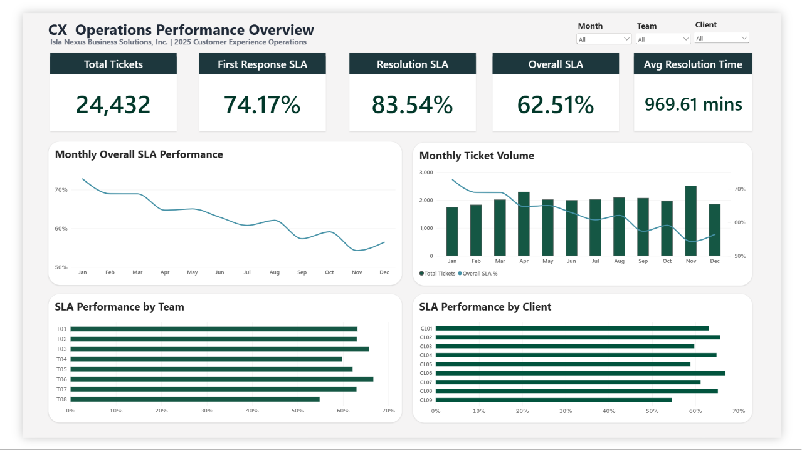

# INBS CX Operations Analytics

**A business-focused data analytics portfolio project investigating customer experience operations, SLA performance, resolution time, and operational trends.**

> **Project status:** Portfolio project | 2025 fictional operational dataset | One-page Power BI dashboard

## Summary

- **Problem:** Resolution SLA fell from **90.8% in Q1 2025 to 77.2% in Q4**.
- **Main finding:** The decline is a **resolution problem**, not a response problem, and it appears across teams and shifts rather than in one isolated area.
- **Top recommendation:** Investigate the resolution stage (approvals, escalations, reassignments), align staffing with ticket volume, and monitor SLA monthly.

---

## 1. Project Overview

Isla Nexus Business Solutions, Inc. (INBS) is a fictional Philippine business process outsourcing (BPO) company providing 24/7 customer experience (CX) support.

This project investigates a reported decline in service-level agreement (SLA) performance throughout 2025. The analysis examines ticket volume, first-response performance, resolution performance, resolution time, teams, clients, shifts, priorities, and selected workload indicators.

The project follows a practical analytics workflow:

**Raw data → Data profiling → Data-quality checks → SQL cleaning and transformation → Analytical data model → DAX measures → Power BI dashboard → Business insights and recommendations**

The goal is not to claim a single proven root cause. Instead, the project identifies evidence-based patterns and possible contributing factors that management could investigate further.

---

## 2. Business Problem

INBS management reported concerns about declining customer support SLA performance.

**Resolution SLA fell from 90.8% in Q1 2025 to 77.2% in Q4, a drop of 13.7 percentage points.** Resolution SLA should be at least 90%, but Q4 fell below even the 85% service-credit floor.

Management wanted to understand:

- How SLA performance changed throughout 2025
- Whether the decline was concentrated in particular teams, clients, shifts, or priorities
- Whether resolution time increased alongside SLA deterioration
- Whether workload pressure may be associated with lower SLA performance
- Whether data-quality issues could affect the reliability of reported KPIs
- Which operational areas should be investigated for improvement

### Main business question

> How did CX operational performance change during 2025, and what factors may be contributing to the deterioration?

---

## 3. Project Objectives

1. Profile and validate the raw operational data.
2. Identify duplicates, missing values, invalid values, orphan records, and inconsistent fields.
3. Apply defensible cleaning rules without overwriting the raw source.
4. Match tickets to the correct time-effective SLA policy.
5. Calculate validated SLA and resolution-time metrics.
6. Build a business-oriented Power BI dashboard.
7. Identify trends and operational patterns.
8. Provide practical recommendations while distinguishing evidence from assumptions.

---

## 4. Tools and Technologies

| Tool | Purpose |
|---|---|
| PostgreSQL / SQL | Raw data storage, cleaning, deduplication, normalization, joins, validation, temporal SLA matching, and KPI preparation |
| Power BI | Data modeling, interactive dashboarding, visual analysis, and slicers |
| DAX | Business measures such as ticket counts, SLA rates, and average/median resolution time |
| Excel / CSV | Source data format and spot-checking where applicable |
| GitHub | Version control, documentation, and portfolio presentation |

### Tool-selection principle

Tools were selected according to the task. SQL was used for relational transformations and reproducible database-based preparation. Power BI was used for modeling and visualization. DAX was used for business measures rather than generic data cleaning.

---

## 5. Dataset Description

The dataset represents a fictional 24/7 BPO customer experience operation.

### Main entities

- Clients
- Teams
- Shifts
- Categories
- Agents
- SLA policies
- Tickets
- Customer feedback
- Monthly staffing

### Ticket coverage

- Reporting period: **January 1–December 31, 2025**
- Raw ticket rows: **24,529**
- Cleaned ticket rows: **24,432**
- Unique ticket IDs after cleaning: **24,432**

### How SLA is measured

Each ticket has two deadlines:

- **First Response SLA:** Did an agent first reply within the target time?
- **Resolution SLA:** Was the ticket resolved within the target time?
- **Overall SLA:** Did the ticket meet **both** deadlines? This is the strictest measure.

SLA % = tickets that met the target ÷ tickets that could be evaluated. Quarters are based on ticket **[creation date / resolution date]**.

### SLA rules represented in the dataset

- Main SLA compliance target: **90%**
- Secondary service-credit/penalty floor: **85%**
- Continuous 24/7 SLA clock
- Pending customer time is not excluded
- Resolution thresholds vary by priority
- Client tiers apply SLA multipliers
- SLA policies are matched according to their effective dates

> The dataset is fictional and intended for learning, portfolio demonstration, and analytical practice. It does not represent actual INBS company data.

---

## 6. Data Preparation and Quality Checks

The raw data was preserved separately from the cleaned and analytical layers.

### Key quality issues investigated

| Issue | Treatment |
|---|---|
| Exact duplicate ticket rows | Confirmed using full-field comparison, then deduplicated in the clean layer |
| Missing client IDs | Imputed only when the agent had exactly one known client; ambiguous cases remained NULL |
| Orphan agent IDs | Retained and flagged because no reliable agent mapping was available |
| Agent/team mismatches | Original values retained; mismatches documented for interpretation |
| Missing category IDs | Recovered using an exact category-label mapping |
| Missing first-response timestamps | Original NULLs retained; duration values preserved and possible reconstructed timestamps treated as derived |
| Missing resolution values | Retained when consistent with unresolved, cancelled, pending, escalated, or new ticket statuses |
| Inconsistent resolution duration | Created `resolution_mins_derived` from `resolved_at - created_at` while preserving the original field |
| Invalid CSAT scores | Preserved in raw data; invalid values excluded from clean CSAT calculations |
| Duplicate feedback rows | Exact duplicate feedback records deduplicated in the clean layer |
| Orphan feedback | Retained and flagged when the feedback ticket ID was not found |
| Status and priority variants | Normalized into consistent analytical fields |
| SLA policy gaps | Left unevaluable instead of force-matching a policy |

### Data-quality principles

- Raw data was not overwritten.
- NULL values were not automatically treated as errors.
- Unevaluable tickets were not automatically classified as SLA failures.
- Ambiguous records were flagged or retained rather than guessed.
- Derived analytical fields were kept separate from original source fields.
- Cleaning decisions were based on evidence from the available data.

---

## 7. Power BI Dashboard

### Dashboard title

**CX Operations Performance Overview**

### Dashboard purpose

The single-page dashboard summarizes CX performance and changes throughout 2025.

### KPI cards

* Total Tickets
* Overall SLA %
* First Response SLA %
* Resolution SLA %
* Average Resolution Time

### Main Visuals

1. **Monthly Overall SLA Trend**  
   Shows how SLA performance changed throughout the year.

   

2. **Monthly Ticket Volume and SLA**  
   Compares ticket volume with SLA performance to identify possible workload patterns.

   

3. **SLA by Team**  
   Compares performance across operational teams.

   

4. **SLA by Client**  
   Highlights differences in SLA performance between clients.

   

> Note: An interactive Power BI link is not currently available.
> The dashboard screenshot at the top of this README is provided for portfolio demonstration.

---

## 8. Key Insights

### Overall performance

- Total cleaned tickets: **24,432**
- SLA-evaluable tickets: **23,321**
- Resolution SLA: **83.54%**
- First Response SLA: **74.17%**
- Overall SLA (both targets met): **62.51%**
- Average resolution time: **969.61 minutes**

### Quarterly deterioration

| Metric | Q1 | Q4 | Change |
|---|---:|---:|---:|
| **Resolution SLA** | 90.83% | 77.18% | -13.65 percentage points |
| First Response SLA | 76.69% | 72.80% | -3.89 percentage points |
| Overall SLA (both targets met) | 70.13% | 56.42% | -13.71 percentage points |
| Average Resolution Time | 814.59 min | 1,096.63 min | +34.6% |

### Interpretation

1. Resolution SLA is the main deterioration: it fell from 90.83% to 77.18%. This closely matches management's reported decline (roughly 91% to the mid-70s).
2. Resolution declined much more than first response (-13.65 vs -3.89 points). The drop in Overall SLA is almost entirely driven by resolution.
3. Average resolution time increased by 34.6%, supporting the finding that tickets were taking longer to resolve.
4. Workload intensity (tickets per scheduled agent-hour, by team-month) had a moderate negative association with SLA (r = **[x]**, n = **[y]**) and a moderate positive association with resolution time.
5. CL09's ticket share increased during the year, suggesting additional workload pressure, but non-CL09 operations also deteriorated.
6. **[X of 8]** teams and **[all]** shifts declined, so the evidence does not support blaming one isolated team or shift.
7. System migration is contextual information, not proven causation, because the source system and time period are confounded.

### Analytical caution

These findings identify associations and patterns. They do not prove that workload, CL09 onboarding, staffing, shift, or system migration independently caused the SLA decline.

---

## 9. Recommendations

The recommendations below are proposed follow-up actions based on the observed patterns. They should be validated using additional operational data before implementation.

### 1. Investigate resolution bottlenecks

Review the ticket categories, clients, escalation paths, reassignment patterns, and approval steps associated with longer resolution times.

### 2. Review workload and capacity

Compare ticket volume and workload intensity against staffing availability, absence hours, queue backlog, and shift coverage.

### 3. Examine client-specific processes

Investigate whether particular clients have stricter targets, approval delays, complex workflows, or higher reassignment rates.

### 4. Review CL09 onboarding impact

Assess whether the growing CL09 volume affected staffing, training, queue allocation, or operational capacity.

### 5. Improve data-quality monitoring

Introduce recurring checks for duplicates, orphan IDs, missing policy matches, invalid scores, and inconsistent timestamps.

### 6. Create an ongoing SLA monitoring process

Track monthly SLA, resolution time, workload intensity, and staffing indicators so deterioration can be identified earlier.

---

## 10. Deliverables

- [x] Raw and cleaned data layers
- [x] SQL data-quality checks
- [x] Analytical ticket table
- [x] Time-effective SLA policy matching
- [x] DAX KPI measures
- [x] One-page Power BI dashboard
- [x] Business insights
- [x] Recommendations

---

## 11. Limitations

- The dataset is fictional.
- Management's reported decline (roughly 91% to the mid-70s) reconciles closely with the validated Resolution SLA (90.8% to 77.2%). Overall SLA is a stricter both-targets measure and is reported separately.
- Correlation does not establish causation.
- Some records remain unevaluable because of missing client information, missing applicable policies, or unavailable duration data.
- Staffing analysis is limited by the available fields and does not establish causal impact.
- The dataset does not contain every operational variable that could explain SLA performance, such as queue backlog, detailed approval timestamps, or complete reassignment history.

---

## 12. Final Note

This project demonstrates an end-to-end analytical workflow, from understanding a business problem and validating messy data to preparing an analytical model and communicating findings through a Power BI dashboard.

AI tools were used as a learning and productivity aid during development. SQL queries, validation results, cleaning decisions, and analytical conclusions were reviewed and tested against the dataset.
